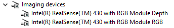
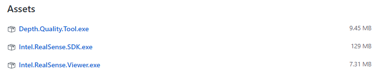
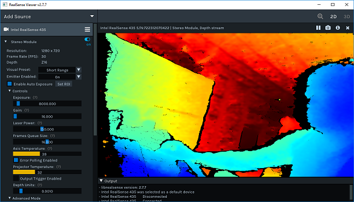
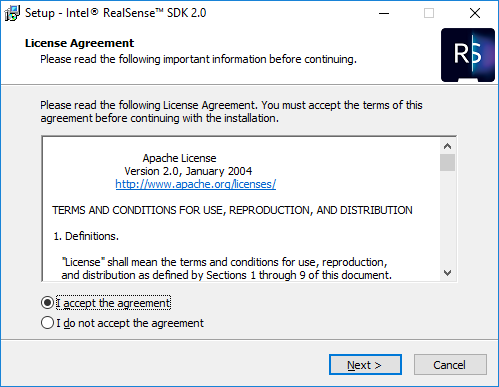
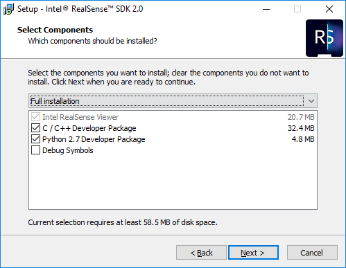
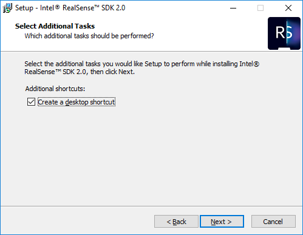
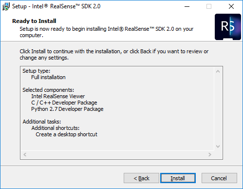
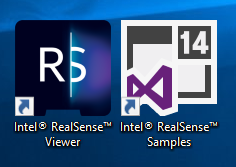
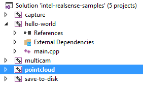

# Windows Distribution

**Intel® RealSense™ SDK 2.0** provides tools and binaries for the Windows platform using [GitHub Releases](https://github.com/IntelRealSense/librealsense/releases)

> To build from source, please follow the steps described [here](installation_windows.md)

After plugging the camera into a USB3 port, you should be able to see the newly connected device in the Device Manager: 

## Intel RealSense Viewer

* Go to the [latest stable release](https://github.com/IntelRealSense/librealsense/releases/latest), navigate to the **Assets** section, download and run **Intel.RealSense.Viewer.exe**: 
* Explore the depth data:

## Installing the SDK

* Go to the [latest stable release](https://github.com/IntelRealSense/librealsense/releases/latest), navigate to the **Assets** section, download and run **Intel.RealSense.SDK.exe**:
* Click through several simple steps of the installer:
* Intel® RealSense™ SDK 2.0 is distributed under the [Apache 2.0](https://github.com/kzobov/librealsense/tree/7148f9ae1d78b5d44bee4fc578bf0b8fb9a220c5/LICENSE/README.md) permissive open-source license:

1. The SDK includes the RealSense Viewer, as well as development packages for various programming languages:

1. Approve adding two shortcuts to your desktop:

   

2. Review before installing:

1. Open the `Intel® RealSense™ Samples`solution:

1. Press `F5` to compile and run the demos:

1. Success!

