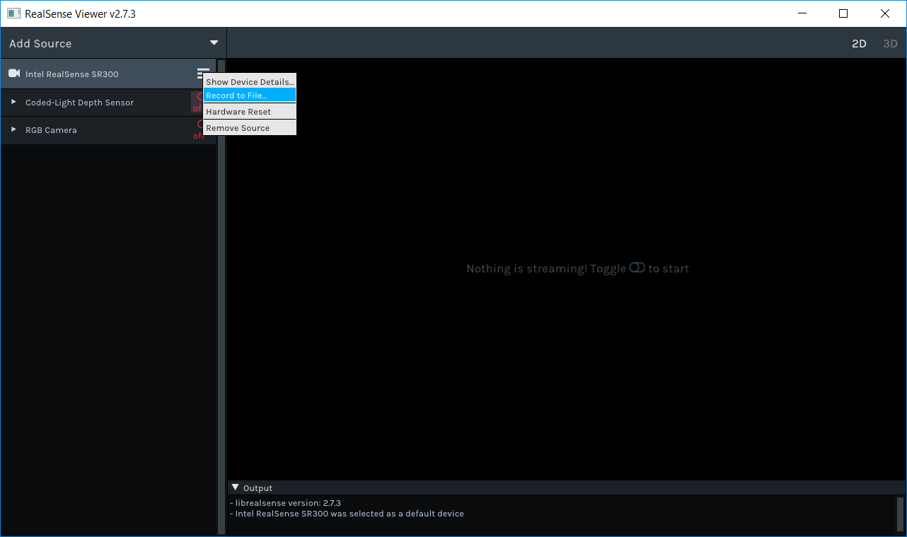
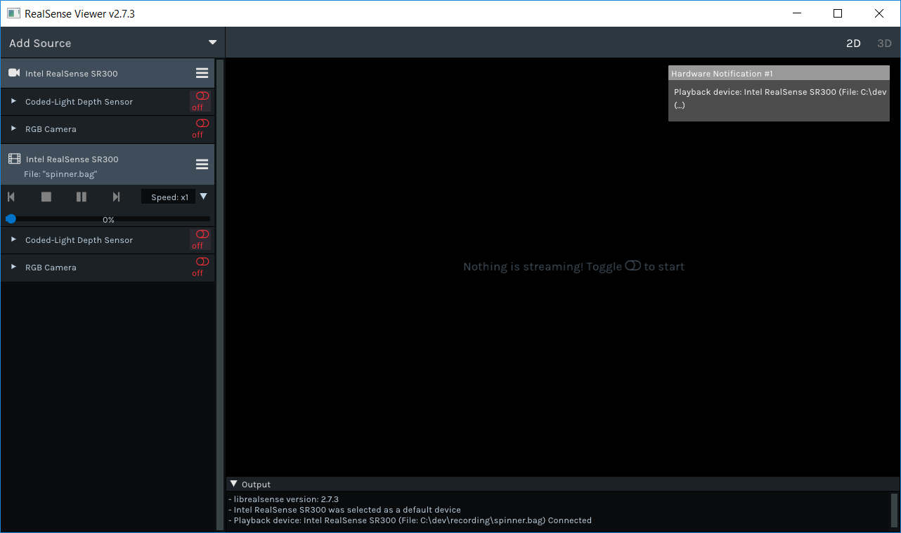

# Realsense Record and Playback

## Overview

In addition to streaming video and other data from devices and sensors, the realsense SDK provides the ability to record a live session of streaming to a file. The recorded files can later be loaded by the SDK and to create a device with "read-only" abilities of the recorded device \( we will explain what "read-only" abilities mean later on\). The SDK is recording a single device to a single [rosbag file](http://wiki.ros.org/rosbag), using mostly standard ROS messages. This allows files recorded by the SDK to be replayed using any ROS tools  application.

> For example recording files, please see [Sample Data](../../doc/sample-data.md)

## Quick Start

#### `rs2::recorder`

> :exclamation: If you are not familiar with the basic streaming [examples](https://github.com/kzobov/librealsense/tree/7148f9ae1d78b5d44bee4fc578bf0b8fb9a220c5/examples/README.md), please follow them before moving on

To enable recording of any device, simply create a **rs2::recorder** from it and provide a path to the desired output file:

```cpp
//Create a context and get the first device
rs2::context ctx;
auto devices = ctx.query_devices();
if (devices.size() > 0)
{
    //Create a rs2::recorder from the first device, and desired file name
    //'.bag' is the common extension for rosbag files
    rs2::recorder device("my_file_name.bag", devices[0]);     
    //recorder "is a" device, so just use it like any other device now
}
```

A `recorder` has the same functionality as a "real" device, with additional control for recording, such as pausing and resuming record.

#### `rs2::playback`

> :exclamation: If you are not familiar with the basic streaming [examples](https://github.com/kzobov/librealsense/tree/7148f9ae1d78b5d44bee4fc578bf0b8fb9a220c5/examples/README.md), please follow them before moving on

Recorded files can be loaded and used to create a playback device by simply loading a file to the context:

```cpp
//Create a context
rs2::context ctx;
//Load the recorded file to the context
rs2::playback device = ctx.load_device("my_file_name.bag");
//playback "is a" device, so just use it like any other device now
```

The above code creates a playback device, which can be used as any device, but has the obvious limitation of only playing the recorded streams. Playback devices can be used to query information on the device and it sensors, and can be extended to which ever extension the "real" device could. A `playback` provides additional functionalities such as seek, pause, resume and playback speed.

### Using `rs2::config` with `rs2::pipeline`

The `rs2::pipeline` can be configured to record or play a streaming session by providing it with a `rs2::config` of your choice:

Recording to file:

```cpp
rs2::config cfg;
cfg.enable_record_to_file("path_to_output_file.bag");
rs2::pipeline pipe;
pipe.start(cfg); //File will be opened in write mode at this point
for (int i = 0; i < 30; i++)
{
    auto frames = pipe.wait_for_frames();
    //use frames here
}
pipe.stop(); //File will be closed at this point
```

Playing from file:

```cpp
rs2::config cfg;
cfg.enable_device_from_file("path_to_input_file.bag");
rs2::pipeline pipe;
pipe.start(cfg); //File will be opened in read mode at this point
for (int i = 0; i < 30; i++)
{
    rs2::frameset frames;
    if (pipe.poll_for_frames(&frames))
    {
        //use frames here
    }
    //Note that we use poll_for_frames instead of wait_for_frames
    //This is because the file only contains a finite amount of frames
    // and if we use wait_for_frames then after reading the entire file
    // we will fail to wait for the next frame (and get an exception)
}
pipe.stop(); //File will be closed at this point
```

## Playback and Record in RealSense Viewer

Among its many features, the [RealSense Viewer](https://github.com/kzobov/librealsense/tree/7148f9ae1d78b5d44bee4fc578bf0b8fb9a220c5/tools/realsense-viewer/README.md) allows recording a device, and loading a file to playback.

To record a streaming session, simply click the "bars" icon next to the device name, choose "Record to File...", and select the destination for the file.



After choosing a file destination, a red dot will appear next to the device's name, indicating that it is recording. Starting a stream will save its frames to the file, and once all streams are stopped, recording will complete automatically.

To replay a file, click "Add Source", choose "Load Recorded Sequence" and select the file you want to play. Once you select the file, the Viewer will automatically add it the the list of source, and a popup should appear stating that the file was loaded:



> Notice that devices that were loaded from file have a "movie" icon next to their name.

After loading the file, you can start streaming its streams, view its controls \(with the values at time of record\), pause the playback, choose speed, and use the seek bar to navigate trough frames.

## Under the Hood

#### Basics Terminology

A **Device** is a container of Sensors with some correlation between them \(e.g - all sensors are on a single board, sensors are mounted on a robot and share calibration information, etc.\). A **Sensor** is a data streaming object, that provides one or more Streams. **Stream** is a sequence of data items of a single data type, which are ordered according to their time of creation or arrival. The Sensor provides the Streams frames to the user.

We call the device's sensors and stream, the **topology** of the device.

Devices and Sensors can have **Extensions** that provide additional functionalities. A **Snapshot** of an Extension is a snapshot of the data that is available by the extension at some point of time, it is a sort of "read-only" version of the extension. For example, say we have a `DigitalClockExtension`, that can set and show the time. If we take a snapshot of that extension at noon, then whenever we ask the snapshot to show the time it will show "12:00", and trying to set its time will fail.

Finally, we will refer to a an actual implementation of devices and sensors as "live" or "real" devices and sensors.

#### Rosbag

**Overview on ROSBAG file structure**

The Rosbag file consists of data records, each data that is written to the file is represented by a topic that represents the data content, message that is the data definition, and capture time. Any topic can be coupled with any message, in our file each topic will be represented by a single message. However, we will have different topics with the same message such as property.  
A bag file consists of a list of records, each record can be one of the following types:

* Bag header. Stores information about the entire bag, such as the offset to the first index data record, and the number of chunks and connections.
* Chunk. Stores \(possibly compressed\) connection and message records.
* Connection. Stores the header of a ROS connection, including topic name and full text of the message definition \(message structure\).
* Message data. Stores the serialized message data \(which can be zero-length\) with the ID of the connection.
* Index data. Stores an index of messages in a single connection of the preceding chunk.
* Chunk info. Stores information about messages in a chunk.

Each message that we write is stored in a chunk, each chunk consists of a number of messages based on the chunk size. In addition to the message data, the chunk stores also the connections of the messages, the connection describes the topic name and message definition to be able to serialize the message data. The flow to find a message on topic “A”:

* Check in all chunk info’s what kind of connections can be found in the chunk.
* Access the chunk with the wanted connection, chunk info contains an offset to the paired chunk.
* Access the message from the relevant index data.

**Dependencies**

The SDK depends on ROS packages that are used for recording and playing the bag file. The dependencies are:

* rosbag\_storage
* roscpp\_serialization
* cpp\_common
* rostime
* boost\_system
* lz4

> **Note:** The above dependencies are embedded into the source files, there is no need for additional installations.

**Topics**

The rosbag file requires messages to be associates with Topics

> Topics are [named](http://wiki.ros.org/Names) buses over which [nodes](http://wiki.ros.org/Nodes) exchange [messages](http://wiki.ros.org/Messages). [\[ROS Wiki\Topics\]](http://wiki.ros.org/Topics)

The following table depicts the Topics that are supported by RealSense file format:

| Topic | Published Name | Message Type | Description |
| :--- | :--- | :--- | :--- |
| File Version | /file\_version | [std\_msgs/UInt32](http://docs.ros.org/api/std_msgs/html/msg/UInt32.html) | Version of file format. A single message for entire file |
| Device Information | /device\_&lt;device\_id&gt;/info | [diagnostic\_msgs/KeyValue](http://docs.ros.org/api/diagnostic_msgs/html/msg/KeyValue.html) | Device information. Many messages to a single topic |
| Sensor Information | /device\_&lt;device\_id&gt;/info | [diagnostic\_msgs/KeyValue](http://docs.ros.org/api/diagnostic_msgs/html/msg/KeyValue.html) | Sensor information. Many messages to a single topic |
| Stream Information | /device\_&lt;device\_id&gt;/sensor\_&lt;sensor\_id&gt;/&lt;stream\_type&gt;\_&lt;stream\_id&gt;/info | [realsense\_msg/StreamInfo](media.md#stream-info) | generic-stream information A single messages to a single topic |
| Video Stream Info | /device\_&lt;device\_id&gt;/sensor\_&lt;sensor\_id&gt;/&lt;stream\_type&gt;\_&lt;stream\_id&gt;/info/camera\_info | [sensor\_msgs/camera\_info](http://docs.ros.org/api/sensor_msgs/html/msg/CameraInfo.html) | Image information. A single messages to a single topic |
| IMU Intrinsics | /device\_&lt;device\_id&gt;/sensor\_&lt;sensor\_id&gt;/&lt;stream\_type&gt;\_&lt;stream\_id&gt;/info/imu\_intrinsic | [realsense\_msgs/ImuIntrinsic](media.md#motion-intrinsic) | Intrinsic of a motion stream. A single messages to a single topic |
| Options | /device\_&lt;device\_id&gt;/sensor\_&lt;sensor\_id&gt;/option/&lt;option name&gt;/value /device\_&lt;device\_id&gt;/sensor\_&lt;sensor\_id&gt;/option/&lt;option name&gt;/description | [std\_msgs/Float32](http://docs.ros.org/api/std_msgs/html/msg/Float32.html) [std\_msgs/String](http://docs.ros.org/api/std_msgs/html/msg/String.html) | Options of a sensor. values represent the value of the option and has many messages to a single topic description is a human readable description of the option, with a single messages to a single topic |
| Image Data | /device\_&lt;device\_id&gt;/sensor\_&lt;sensor\_id&gt;/&lt;stream\_type&gt;\_&lt;stream\_id&gt;/image/data | [sensor\_msgs/Image](http://docs.ros.org/api/sensor_msgs/html/msg/Image.html) | The data of a single image. A single messages to a single topic |
| Image Information | /device\_&lt;device\_id&gt;/sensor\_&lt;sensor\_id&gt;/&lt;stream\_type&gt;\_&lt;stream\_id&gt;/image/metadata | [diagnostic\_msgs/KeyValue](http://docs.ros.org/api/diagnostic_msgs/html/msg/KeyValue.html) | Additional information of a single image. Many message to a single topic |
| IMU Data | /device\_&lt;device\_id&gt;/sensor\_&lt;sensor\_id&gt;/&lt;stream\_type&gt;\_&lt;stream\_id&gt;/imu/data | [sensor\_msgs/Imu](http://docs.ros.org/api/sensor_msgs/html/msg/Imu.html) | The data of a single imu frame. A single messages to a single topic |
| IMU Information | /device\_&lt;device\_id&gt;/sensor\_&lt;sensor\_id&gt;/&lt;stream\_type&gt;\_&lt;stream\_id&gt;/imu/metadata | [diagnostic\_msgs/KeyValue](http://docs.ros.org/api/diagnostic_msgs/html/msg/KeyValue.html) | Additional information of a single imu frame. Many message to a single topic |
| Pose Data | /device\_&lt;device\_id&gt;/sensor\_&lt;sensor\_id&gt;/&lt;stream\_type&gt;\_&lt;stream\_id&gt;/pose/{transform, accel, twist}/data |  | The Pose data is split into 3 messages \(each under different topic [\[1\]](media.md#1-pose-frames)\):  |
| Pose Information | /device\_&lt;device\_id&gt;/sensor\_&lt;sensor\_id&gt;/&lt;stream\_type&gt;\_&lt;stream\_id&gt;/pose/metadata | [diagnostic\_msgs/KeyValue](http://docs.ros.org/api/diagnostic_msgs/html/msg/KeyValue.html) | Additional information of a single pose frame. Many message to a single topic |
| Occupancy Map Data | /device\_&lt;device\_id&gt;/sensor\_&lt;sensor\_id&gt;/&lt;stream\_type&gt;\_&lt;stream\_id&gt;/occupancy\_map/data | [nav\_msgs/OccupancyGrid](http://docs.ros.org/api/nav_msgs/html/msg/OccupancyGrid.html) |  |
| Occupancy Map Information | /device\_&lt;device\_id&gt;/sensor\_&lt;sensor\_id&gt;/&lt;stream\_type&gt;\_&lt;stream\_id&gt;/occupancy\_map/metadata | [diagnostic\_msgs/KeyValue](http://docs.ros.org/api/diagnostic_msgs/html/msg/KeyValue.html) | Additional |
| Time Stream | /device\_&lt;device\_id&gt;/sensor\_&lt;sensor\_id&gt;/time | [sensor\_msgs/TimeReference](http://docs.ros.org/jade/api/sensor_msgs/html/msg/TimeReference.html) |  |
| Log | /log | [rosgraph\_msgs/Log](http://docs.ros.org/jade/api/rosgraph_msgs/html/msg/Log.html) | Log messages |
| Stream Exntrinsics | /device\_&lt;device\_id&gt;/sensor\_&lt;sensor\_id&gt;/&lt;stream\_type&gt;\_&lt;stream\_id&gt;/tf/&lt;group\_index&gt; | [geometry\_msgs/Transform Message](http://docs.ros.org/jade/api/geometry_msgs/html/msg/Transform.html) | Extrinsic transformation between some point of reference \(indexed by group\_index\) to the stream in the topic |
| Additional Info | /additional\_info | [diagnostic\_msgs/KeyValue](http://docs.ros.org/api/diagnostic_msgs/html/msg/KeyValue.html) | Additinal information of any kind. Can be useful for application that require additional metadata on the recorded file \(such as program name, version etc...\) |
| Sensor Notification | /device\_&lt;device\_id&gt;/sensor\_&lt;sensor\_id&gt;/notification/&lt;rs2\_notification\_category&gt; | [realsense\_msgs/Notification](media.md#notification) | Additinal information of any kind. Can be useful for application that require additional metadata on the recorded file \(such as program name, version etc...\) |

**\[1\] Pose frames**

As you might have noticed, pose data is split into three messages, each under a different topic. The reasons for this choice is so that we expose only standard ros messages instead of creating a proprietary message. This choice allows any common tool that uses rosbag to read the content of a pose frame \(and most of the rest of the messages we save\).

When reading a file using the SDK's playback, the reader will only iterate over `pose/transform` messages and for each of those messages, will match the corresponding `pose/accel` and `pose/twist` message to form a single pose frame. This matching of messages adds an overhead of searching the file for a single message, each frame. But, this overhead should have minor performance impact even for huge files since it is merely a tree search \(See [ros/ros\_comm: PR \#1223 - Performance improvement for lower/upper bound](https://github.com/ros/ros_comm/pull/1223)\)

**Messages**

ROS uses a simplified messages description language for describing the data values \(aka messages\) that ROS nodes publish. This description makes it easy for ROS tools to automatically generate source code for the message type in several target languages. Message descriptions are stored in .msg files. There are two parts to a .msg file: fields and constants. Fields are the data that is sent inside of the message. Constants define useful values that can be used to interpret those fields \(e.g. enum-like constants for an integer value\).

#### RealSense Proprietary  Messages

In addition to the standard ROS messsages, the SDK writes additional proprietary messages \(available in the [3rd party folder](https://github.com/kzobov/librealsense/tree/7148f9ae1d78b5d44bee4fc578bf0b8fb9a220c5/third-party/realsense-file/rosbag/msgs/realsense_msgs/README.md)\) for new data types that are recorded. The following are the new messages created by the SDK:

* [realsense\_msgs::StreamInfo](media.md#stream-info)
* [realsense\_msgs::ImuIntrinsic](media.md#motion-intrinsic)

**Stream Info**

This message defines meta information for a stream The stream type is expressed in the topic name

| Name | Description | Format |
| :--- | :--- | :--- |
| is\_recommended | Indicates if this stream is recommended by RealSense SDK | bool |
| fps | Frame per second value | uint32 |
| encoding | Stream's data format. Supported encodings are listed below | string |

**Supported Encoding**

For video streams, the supported encoding types can be found at [ros documentation](http://docs.ros.org/jade/api/sensor_msgs/html/namespacesensor__msgs_1_1image__encodings.html). Additional supported encodings are listed under [rs\_sensor.h](https://github.com/kzobov/librealsense/tree/7148f9ae1d78b5d44bee4fc578bf0b8fb9a220c5/include/librealsense2/h/rs_sensor.h) as the `rs2_format` enumeration. Note that some of the encodings appear in both locations.

**Motion Intrinsic**

This message defines a Motion device's intrinsic: scale, bias, and variances

| Name | Description | Format |
| :--- | :--- | :--- |
| data | Interpret data array values. 3x4 Row-major matrix: | float32\[12\] |
| noise\_variances | Variance of noise for X, Y, and Z axis | float32\[3\] |
| bias\_variances | Variance of bias for X, Y, and Z axis | float32\[3\] |

**Notification**

This message defines a notification

| Name | Description | Format |
| :--- | :--- | :--- |
| timestamp | The time of occurrence | [std\_msgs/Time](http://docs.ros.org/api/std_msgs/html/msg/Time.html) |
| category | Category of the notification, matching an rs2\_notification\_category | [std\_msgs/String](http://docs.ros.org/api/std_msgs/html/msg/String.html) |
| severity | Severity of the notification, matching an rs2\_log\_severity | [std\_msgs/String](http://docs.ros.org/api/std_msgs/html/msg/String.html) |
| description | Human readable description of the notification | [std\_msgs/String](http://docs.ros.org/api/std_msgs/html/msg/String.html) |
| serialized\_data | JSON string with additional data | [std\_msgs/String](http://docs.ros.org/api/std_msgs/html/msg/String.html) |

### Versioning

Each bag file recorded using this SDK should contains a version message. Version number is a single integer which indicates the version of topics and messages that were used to record the file. The above messages and topics reflect the current version. Changes from previous versions will appear at the end of this section.

> Current file version: _**3**_

Changes from previous version:

* Removed:
  * _**Property**_ topic
* Added:
  * _**Options**_ topic

## Recording

Recording is performed at the Device level, meaning that the device, its sensors, their streams' data \(frames\) and all extensions are saved to file. To allow for a seamless experience when switching between a live device and a record or playback device we save the device's topology and all of the extensions' snapshots to the file, in addition to the streaming frames.

A record device is like a wrapper around a real device, that delegates actions to the device and sensors while recording new data in between actions. When a record device is created, a record sensor is created per real sensor of the real device. A record sensor will record newly arriving frames for each of its streams, and changes to extensions' data \(snapshots\).

Recording related files are:

* [record/record\_device.cpp](https://github.com/kzobov/librealsense/tree/7148f9ae1d78b5d44bee4fc578bf0b8fb9a220c5/src/media/record/record_device.cpp)
* [record/record\_device.h](https://github.com/kzobov/librealsense/tree/7148f9ae1d78b5d44bee4fc578bf0b8fb9a220c5/src/media/record/record_device.h)
* [record/record\_sensor.cpp](https://github.com/kzobov/librealsense/tree/7148f9ae1d78b5d44bee4fc578bf0b8fb9a220c5/src/media/record/record_sensor.cpp)
* [record/record\_sensor.h](https://github.com/kzobov/librealsense/tree/7148f9ae1d78b5d44bee4fc578bf0b8fb9a220c5/src/media/record/record_sensor.h)
* [ros/ros\_writer.h](https://github.com/kzobov/librealsense/tree/7148f9ae1d78b5d44bee4fc578bf0b8fb9a220c5/src/media/ros/ros_writer.h)

A `librealsense::record_device` is constructed with a "live" device and a `device_serializer::writer`. At the moment the only `device_serializer::writer` we use is a `ros_writer` which writes device information to a rosbag file.

When constructing a `ros_writer` the requested file is created if it does not exist, and then opened for writing. In addition, a single message containing the realsense file format version is written to the file. The `ros_writer` implements the `device_serializer::writer` interface which has only 4 functions:

* write\_device\_description
  * Used to record the initial state of the device. This includes writing all of the device's and sensor's extensions.
* write\_frame
  * Used to record a single frame to file
* write\_snapshot \(2 overloads\)
  * Used to record a snapshot of an extension to file.

#### Recording device description

A device description \(or device snapshot\) is the set of data that is available for any `librealsense::device`. It contains all of the device's extensions snapshots, and a collection of each of the device's sensors' extensions snapshots. In addition it holds a mapping of extrinsic information for all streams of the device.

A single `librealsense::device_snapshot` instance is enough to understand the a device's topology: Which extensions it supports, how many sensors it has, which extensions each sensor supports, which streams each sensor supports and which streams share calibration information \(extrinsic\).

#### Recording Frames

Each frame in the SDK implements the `librealsense::frame_interface` interface. This means that frames are polymorphic and represent all types of data that streams provide. Frames are recorded to file with all of their additional information \(such as metadata, timestamp, etc...\), and the time that they arrived from the backend to the sensor.

#### Recording Snapshots

Upon creation, the record device goes over all of the extensions of the real device and its sensors, and saves snapshots of those extensions to the file \(This is the data that is passed to `write_device_description(..)`\) . These snapshots will allow the playback device to recreate the topology of the recorded device, and will serve as the initial data of their extensions. To allow record sensors to save changes to extensions' data over the life time of the program, when a user asks a record sensor for an extension, a record-able extension is provided. A record-able version of an extension holds an action to perform whenever the extension's data changes. This action is provided by the record device \(or sensor\), and requires extensions to pass a reference of themselves to the device, which will usually create a snapshot from them and record them to file with the time at which they occurred.

## Playback

Playback device is an implementation of device interface which reads from a file to simulate a real device.

Playback device holds playback sensors which simulate real sensors.

When creating the playback device, it will read the initial device snapshot from the file in order to map itself and its sensors in matters of functionality and data provided.  
When creating each sensor, the device will create a sensor from the  
sensor's initial snapshot.  
Each sensor will hold a single thread for each of the sensor's streams which is used to raise frames to the user. The playback device holds a single reading thread that reads the next frame in a loop and dispatches the frame to the relevant sensor.

