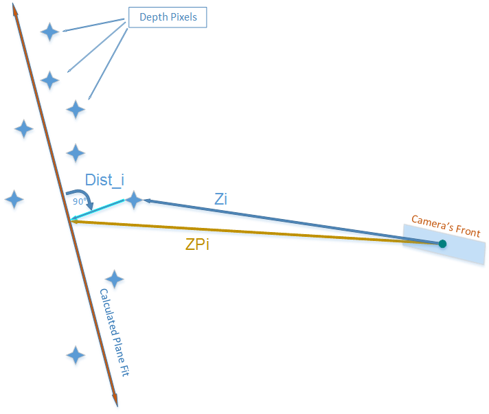
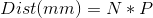
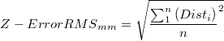
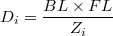
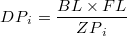
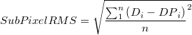
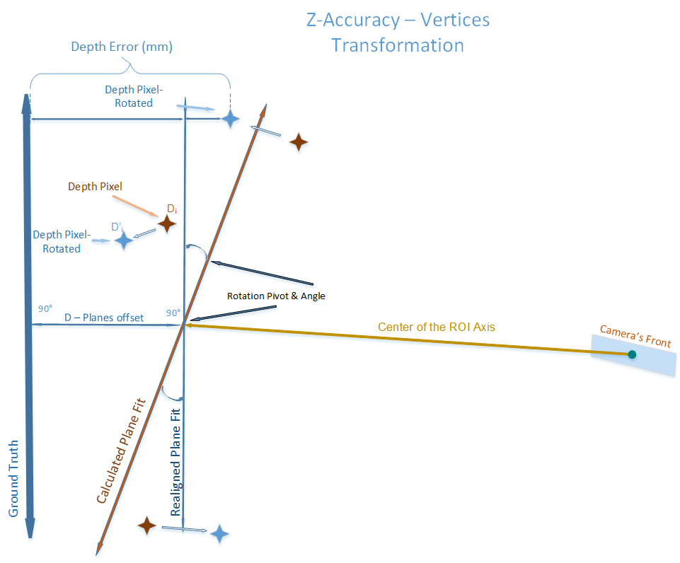
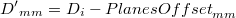
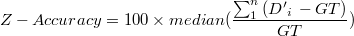

# Depth Quality Tool

## Overview

This application allows you to test the camera’s depth quality, including: Z-Accuracy, Sub-Pixel and Z RMS errors \(spatial noise\) and Fill Rate. You should be able to easily get and interpret several of the depth quality metrics, or record and save the data for offline analysis.   
Please refer to [RealSense DepthQualityTesting White Paper](https://www.intel.com/content/dam/support/us/en/documents/emerging-technologies/intel-realsense-technology/RealSense_DepthQualityTesting.pdf) for further information.

## Quick Start

* Position the depth camera within a range of 0.3 - 2 meter from a flat non-reflective surface.
* Aim the camera to the target and hold it steady for several seconds till the tool is able to recognize the surface \(the yellow grid in 3D view\).
* Adjust the camera using the "Angle" metric to minimize the skew and make it as  perpendicular to the surface as possible.
* Inspect the calculated depth quality metrics, expand the metric properties to get more in-depth info.
* In order to get Z-Accuracy, enable the "Ground Truth" field in UI and modify it with the value obtained/measured with external tools
* Click on "Start\_record" to collect both the metrics and the raw data for offline analysis.  

## Features

* 2D/3D Depth View
* Plane Fitting - using reconstructed surface
* User-defined Region of Interest
* Depth Quality metrics:
  * Z-Accuracy
  * Spatial Noise:
    * Plane Fit RMS Error
    * Sub-Pixel RMS Error
  * Fill-Rate
  * Distance to target
* Export metrics and device configuration
* Depth Sensor controls

## Depth Metrics elaborated

### Fill Rate

the percentage of valid \(non-zero\) pixels within the user-defined Region of Interest \(ROI\) area.

### Distance To Target

estimated distance to an average within the ROI of the target \(wall\) in mm.  
_N_ - Normal of the fitted plane  
_P_ - Center of ROI\(centroid\)

### Plane Fit RMS Error

the metrics represents depth pixels deviation from the calculated Plane Fit. _Disti_ - Distance from depth pixel coordinates to the Plane Fit \(mm\).  

### Sub-Pixel RMS Error

_Zi_ - Depth value of i-th pixel in the ROI \(mm\)  
_ZPi_ - Depth value of the i-th pixel projected onto the plane fit \(mm\)  
_BL_ - Stereoscopic Baseline \(mm\)  
_FL_ -Focal Length as a multiple of pixel width \(pixels\)  
_Di_ - Disparity value of i-th pixel in the ROI \(pixel\)  
_DPi_ - Disparity value of i-th plane-projected pixel \(pixel\)

   

### Z Accuracy

  
_RotationPivotx,y,z_ - Intersection point between the center of the depth censor's ROI and the Fitted Plane  
_PlanesOffsetmm_ - Distance \(signed\) from the Fitted to the Ground Truth planes \(mm\)  
_Di_ - Distance \(signed\) from a depth vertex to the Fitted Plane \(mm\)  
_D'i_ - Z-error: Distance \(signed\) from the rotated _Di_ coordinate to the Ground Truth Plane \(mm\)  
_GT_ - Ground Truth distance to the wall \(mm\)  
  
 

