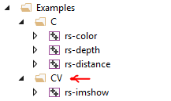

# OpenCV Samples for Intel® RealSense™ cameras

Examples in this folder are designed to complement existing [SDK examples](https://github.com/kzobov/librealsense/tree/7148f9ae1d78b5d44bee4fc578bf0b8fb9a220c5/examples/README.md) and demonstrate how Intel RealSense cameras can be used together with `opencv` in domain of computer-vision.

> RealSense examples have been desinged and tested with OpenCV 3.4, Working with latest OpenCV 4 requires minor code changes

## List of Samples:

1. [ImShow](https://github.com/kzobov/librealsense/tree/7148f9ae1d78b5d44bee4fc578bf0b8fb9a220c5/wrappers/opencv/imshow/README.md) - Minimal OpenCV application for visualizing depth data
2. [GrabCuts](https://github.com/kzobov/librealsense/tree/7148f9ae1d78b5d44bee4fc578bf0b8fb9a220c5/wrappers/opencv/grabcuts/README.md) - Simple background removal using the GrabCut algorithm
3. [Latency-Tool](https://github.com/kzobov/librealsense/tree/7148f9ae1d78b5d44bee4fc578bf0b8fb9a220c5/wrappers/opencv/latency-tool/README.md) - Basic latency estimation using computer vision
4. [DNN](https://github.com/kzobov/librealsense/tree/7148f9ae1d78b5d44bee4fc578bf0b8fb9a220c5/wrappers/opencv/dnn/README.md) - Intel RealSense camera used for real-time object-detection

## Getting Started:

This page is certainly **not** a comprehensive guide to getting started with OpenCV and CMake, but it can help get on the right track.

* [Windows Installation](opencv.md#windows)
* [Linux Installation](opencv.md#linux)

### Windows

1. Download and install `CMake` from [cmake.org/download](https://cmake.org/download/)
2. Clone or download OpenCV sources from [github.com/opencv/opencv/tree/3.4](https://github.com/opencv/opencv/tree/3.4) into a local directory \(`C:/git/opencv-3.4`\)
3. Run `cmake-gui`, input source code and binaries locations: 
4. Click `Configure`

   > When working behind a firewall, you might want to consider unchecking `WITH_FFMPEG` and `WITH_IPP` to avoid additional downloads

5. Uncheck `BUILD_SHARED_LIBS`: 
6. Click `Generate`
7. Click `Open Project` to open Visual Studio
8. Press `Ctrl+Shift+B` to build solution
9. Clone or download librealsense sources from [github.com/IntelRealSense/librealsense](https://github.com/IntelRealSense/librealsense) into a local directory \(`C:/git/librealsense`\)
10. Run `cmake-gui` and fill source code and binaries locations and press `Configure`
11. Make sure you check the `BUILD_CV_EXAMPLES` flag and click `Configure` again:
12. Specify CMake binaries folder for OpenCV as `OpenCV_DIR` \(`c:/git/opencv-3.4`\)
13. Click `Generate` and `Open Project`
14. Locate CV solution-folder under Examples

1. Right-click on one of the examples to `Set as StartUp Project`
2. Press `F5` to compile and run the example

### Linux

1. Build `opencv` from source using the [official guide](https://docs.opencv.org/trunk/d7/d9f/tutorial_linux_install.html)

   > Please use `git checkout 3.4` to use version 3.4

2. Run `export OpenCV_DIR=~/opencv/build` \(`~/opencv/build` is the folder containing `OpenCVConfig.cmake`\)
3. Follow [the instructions](https://github.com/IntelRealSense/librealsense/blob/master/doc/installation.md) to build `librealsense` from source
4. Add `-DBUILD_CV_EXAMPLES=true` to your `cmake` command

